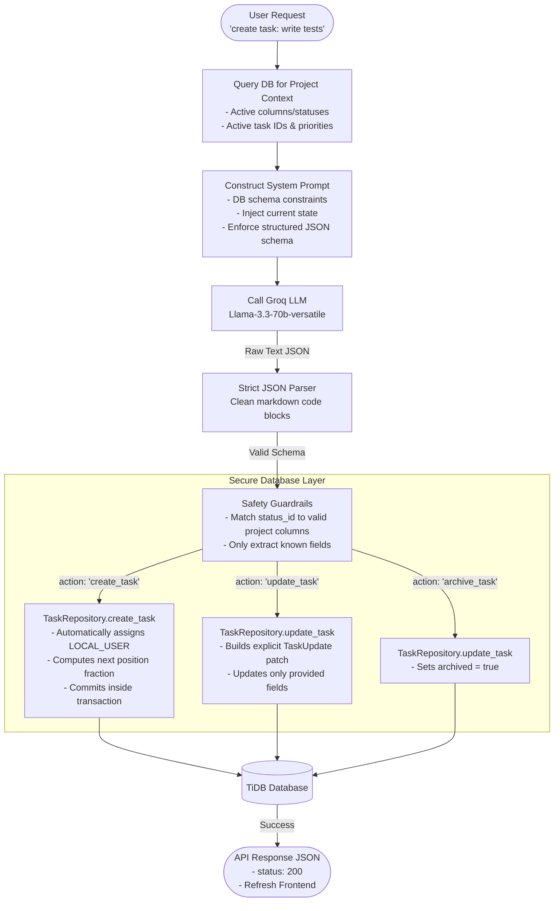

# LLM Mutation Safety Flow & Guardrails

This document explains the security architecture of the AI-driven task modifications (create, edit, remove) in the backend.

## Why this Flow is 100% Safe

1. **No Raw SQL Generation for Mutations**: 
   Unlike the Read-Only orchestrator which compiles raw SQL queries dynamically, the AI mutation engine **never** generates or executes raw SQL queries (`INSERT`, `UPDATE`, `DELETE`). The LLM only generates a structured instructions payload (`"action": "create_task"`, etc.).
   
2. **Schema and Project Isolation**: 
   The backend restricts actions to the current `project_id`. When creating or updating a task, the code verifies that the requested `status_id` actually belongs to the active project's columns. If the LLM generates an invalid `status_id`, it is automatically ignored or defaulted to the first column.

3. **No Direct System Access**: 
   The database changes are run through the pre-audited, type-safe Python repository (`TaskRepository` built with SQLAlchemy). This means standard application logic, like sanitization, audit/activity logging (`self._activity()`), and creation timestamps, is fully preserved.

4. **Transactional Security**: 
   All changes are run within the current database transaction context (`self.session.commit()`). If any repository validation fails, the entire transaction is automatically rolled back, leaving the database clean.
